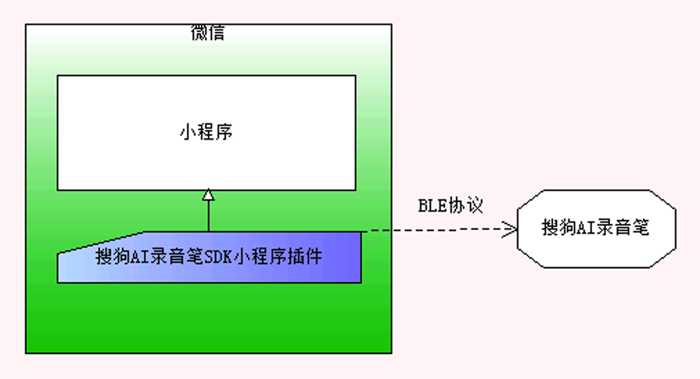

# 搜狗AI录音笔SDK小程序插件

<<<<<<< HEAD
搜狗AI录音笔SDK小程序插件的演示视频在github：https://github.com/zxjay/Sogou-AI-Recorder-mp-plugin/blob/master/show.mp4

该小程序插件可以用于连接控制搜狗AI录音笔，管理录音文件等。
该插件仅能扫描到并且连接搜狗AI录音笔，其它蓝牙设备会被忽略。
=======
搜狗AI录音笔SDK小程序插件，该小程序插件可以用于连接控制搜狗AI录音笔，管理录音文件等。
该插件仅能扫描到并且连接搜狗AI录音笔，其它蓝牙设别会被忽略。
>>>>>>> 0059b6e01eecee7feb214bfa3d67996857b12ed7
搜狗AI录音笔SDK小程序插件架构图如下。



## 1. 引用SDK
在小程序app.json中引用搜狗AI录音笔（简称录音笔）SDK（简称SDK）version 请根据实际填写版本号。

```
"plugins": {
    "AIRecorder": {
        "version": "version",
        "provider": "wxcaba63e60ef46eab"
    }
}
```

## 2. 初始化SDK
在小程序中的app.js中引入SDK

`var plugin = requirePlugin("AIRecorder")`

 App::onLaunch中初始化SDK

`plugin.SogouSDKConfig.initSDK(userId, token, type, protocol, callback)`

userId: 当前用户等userId，用于跟录音笔配对，实现自动连接
token: 申请SDK分配的token
type: 需要使用的录音笔型号 当前为 1
protocol: 协议版本，当前为 1
callback: 录音笔信息回调

示例：

```
plugin.SogouSDKConfig.initSDK("default_user", "6b3a3d173aff", 1, 1, {
    onDeviceFound: function(deviceArray) {
        // device info
    },
    onError: function(errorCode, value, errorMsg) {
        // handle error
    },
    ....
})
```


## 3. 扫描、连接搜狗AI录音笔
* 请确保手机开启蓝牙，并且给微信授权蓝牙权限，安卓手机需要同时给微信授权位置权限

### 3.1 扫描搜狗AI录音笔

`plugin.SogouSDKConfig.SDKAPI().startScanRecorder()`

扫描结果通过SDK初始化传入的callback返回。

## 4. API列表

### 4.1 可调用的API

`plugin.SogouSDKConfig.SDKAPI().*(*)`

```
/**
  解除配对信息
  @params isClearFile true清除录音笔文件 false 保留文件 default
*/
depair(isClearFile) 

/**
  获取session信息
  @params uid requestid(时间戳)
  @params sessionId 录音文件id
  @params isOnlyOne 保留字段false
  
*/
getRecSessionWithUid(uid, sessionId, isOnlyOne) 

/**
  获取录音笔状态
*/
getState() 

/**
  获取录音笔存储容量信息
*/
getStorage() 


/**
  暂停录音，录音笔处于录音状态可用
  @params sessionId 录音文件id
*/
pauseRecord(sessionId) 

/**
  恢复录音
  @params sessionId 录音文件id
  @params scene 场景传入本次录制的场景
     = 0,//默认
     = 1,//标准
     = 2,//采访
     = 3,//演讲
*/
resumeRecord(sessionId,scene) 

/**
  开始录音
  @params recordType 保留字段0
  @params scene 场景
     = 0,//默认
     = 1,//标准
     = 2,//采访
     = 3,//演讲
*/
startRecord(recordType, scene) 

/**
  停止录音
  @params recordType 保留字段0
*/
stopRecord(recordType) 


/**
  删除录音，危险操作请在UI提示用户
  @params sessionId 录音文件id
*/
delRecord(sessionId) 


/**
  开始同步录音文件
  @params sessionId 录音文件id
  @params sessionId fileId=1
  @params start offset文件大小偏移 必须是160的整数倍
  @params end 0表示到结尾 范围是0~文件大小 必须是160的整数倍
  @params type 保留字段 0
*/
startSyncRecord(sessionId,fileId,start,end,type) 

/**
  停止录音文件同步
*/
stopSync() 

/**
  开始扫描录音笔
*/
startScanRecorder() 

/**
  停止扫描录音笔
*/
stopScanRecorder() 

/**
  连接录音笔
  @params deviceId 设备id
  @params deviceName 设备名称
  @params sn 设备序列号
*/
connectRecorder(deviceId, deviceName, sn) 
```

### 4.2 回调信息

```
/**
  音频列表信息回调
  @params uid 
  @params total 总文件数
  @params startPos 保留
  @params sessionArray [memoid,dur]文件列表 dur ms
*/
onGetRecSessionsWithUid(uid, total, startPos, sessionArray)

/**
  录音笔状态回调
  @params state
     = 0x0000,//初始 
     = 0x0001,//开机状态
     = 0x0002,//蓝牙连接状态
     = 0x1003,//4099 录音状态
     = 0x1111,//4369 暂停 自定义的值
     = 0x2222,//8738 停止 自定义的值
  @params isUDisk 是否U盘模式
  @params isPrivacy 隐私模式
  @params keyState 保留
*/
onGetState(state, isUDisk, isPrivacy, keyState)

/**
  录音笔存储容量回调
  @params totalKB 总容量KB
  @params freeKB 剩余容量KB
  @params bytesPerSecond 每秒占用的大小 byte
  @params isFull 是否已满
*/
onGetStorageVolumeWithTotalKB(totalKB, freeKB, bytesPerSecond, isFull)

/**
  暂停录音回调
  @params sessionId 录音文件id
  @params scene 场景
  @params startPos 保留
  @params status 状态 0为成功
*/
onPauseRecord(sessionId, scene, startPos, status)

/**
  恢复录音回调
  @params sessionId 录音文件id
  @params scene 场景
  @params startPos 保留
  @params status 状态 0为成功
*/
onResumeRecord(sessionId, scene, startPos, status)

/**
  开始录音回调
  @params sessionId 录音文件id
  @params scene 场景
  @params startPos 保留
  @params status 状态 0为成功
*/
onStartRecord(sessionId, scene, startPos, status)

/**
  停止录音回调
  @params sessionId 录音文件id
  @params reason 保留
  @params fileExist 保留
  @params fileSize 保留
  @params status 0成功
*/
onStopRecord(sessionId, reason, fileExist, fileSize, status)

/**
  停止文件同步回调
*/
onStopSync()

/**
  错误回调
  @param errorCode 错误码
  @param value 相关值
  @param errorMsg 错误信息
*/
onError(errorCode, value, errorMsg)

/**
  设备列表回调
  @param deviceArray [{name, sn, deviceId}...]
*/
onDeviceFound(deviceArray)

/**
  录音笔连接完成回调
*/
onConnectComplete()
```